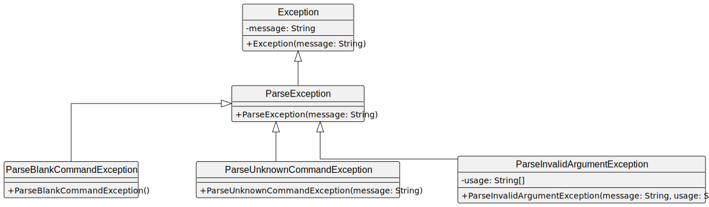
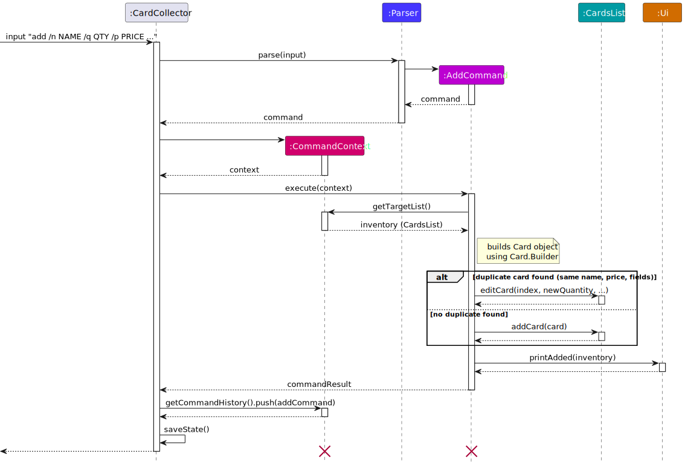
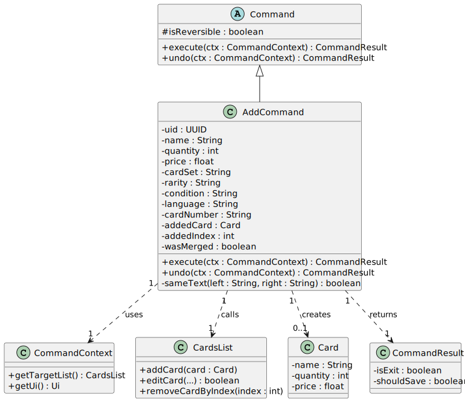
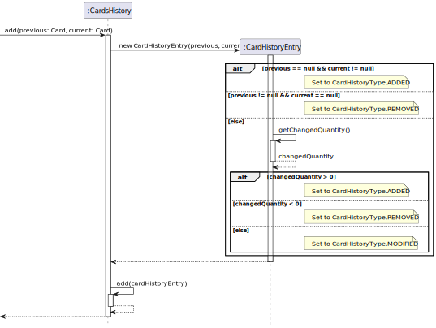
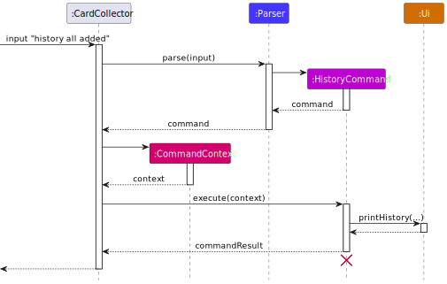

# Developer Guide

## Table of Contents
- [Acknowledgements](#acknowledgements)
- [Design & Implementation](#design--implementation)
    - [Parser](#parser)
        - [Class Diagram](#class-diagram-for-parsing)
    - [Parser: Exceptions](#parser-exceptions)
        - [Class Diagram](#class-diagram-for-parser-exceptions)
    - [Parser: SplitTokenizer](#parser-split-tokenizer)
    - [Parser: Disambiguator](#parser-disambiguator)
    - [Add Feature](#add-feature)
        - [Architecture-level](#architecture-level)
        - [Implementation](#implementation)
        - [Class Diagram](#class-diagram)
    - [Edit Feature](#edit-feature)
        - [Architecture-level](#architecture-level-1)
        - [Implementation](#implementation-key-code-snippets-1)
        - [Sequence Diagram](#sequence-diagram-edit-1-n-dragonite-q-3)
        - [Design decisions](#design-decisions)
    - [Undo Feature](#undo-feature)
        - [Architecture-level](#architecture-level-2)
        - [Implementation](#implementation-key-code-snippets-2)
        - [Sequence Diagram](#sequence-diagram)
    - [List Feature](#list-feature)
        - [Design decisions](#design-decisions-1)
        - [Architecture-level](#architecture-level-3)
        - [Implementation](#implementation-1)
    - [Duplicates Feature](#duplicates-feature)
        - [Architecture-level](#architecture-level-4)
        - [Implementation](#implementation-2)
        - [Design decisions](#design-decisions-2)
    - [Find Feature](#find-feature)
        - [Architecture-level](#architecture-level-5)
        - [Implementation](#implementation-3)
        - [Design decisions](#design-decisions-3)
    - [Analytics Feature](#analytics-feature)
        - [Architecture-level](#architecture-level-6)
        - [Implementation](#implementation-4)
        - [Design decisions](#design-decisions-4)
    - [Filter Feature](#filter-feature)
        - [Architecture-level](#architecture-level-7)
        - [Implementation](#implementation-5)
        - [Design decisions](#design-decisions-5)
    - [Tag Feature](#tag-feature)
        - [Architecture-level](#architecture-level-8)
        - [Implementation](#implementation-6)
        - [Design decisions](#design-decisions-6)
    - [History Feature](#history-feature)
        - [Design decisions for tracking history](#design-decisions-for-tracking-history)
        - [Architecture-level](#architecture-level-9)
        - [Implementation](#implementation-7)
        - [Class Diagram](#class-diagram-1)
        - [Sequence Diagram for adding history entry](#sequence-diagram-for-adding-history-entry)
        - [Design decisions](#design-decisions-7)
        - [Sequence Diagram for history command](#sequence-diagram-for-history-command)
    - [Wishlist Feature](#wishlist-feature)
        - [Architecture-level](#architecture-level-10)
        - [Implementation](#implementation-key-code-snippets-2)
        - [Class Diagram](#class-diagram-2)
        - [Sequence Diagram](#sequence-diagram-wishlist-add-example)
        - [Design decisions](#design-decisions-8)
    - [Compare Feature](#compare-feature)
        - [Architecture-level](#architecture-level-11)
        - [Implementation](#implementation-8)
        - [Design decisions](#design-decisions-9)
    - [Reorder Feature](#reorder-feature)
        - [Architecture-level](#architecture-level-12)
        - [Implementation](#implementation-9)
        - [Design decisions](#design-decisions-10)
    - [Clear Feature](#clear-feature)
        - [Architecture-level](#architecture-level-13)
        - [Implementation](#implementation-10)
        - [Design decisions](#design-decisions-11)
    - [Wishlist Acquired Feature](#wishlist-acquired-feature)
        - [Architecture-level](#architecture-level-14)
        - [Implementation](#implementation-11)
        - [Design decisions](#design-decisions-12)
- [Appendix: Product Scope](#appendix-product-scope)
    - [Target User Profile](#target-user-profile)
    - [Value Proposition](#value-proposition)
- [Appendix: User Stories](#appendix-user-stories)
- [Appendix: Non-Functional Requirements](#appendix-non-functional-requirements)
- [Appendix: Glossary](#appendix-glossary)
- [Appendix: Instructions for Manual Testing](#appendix-instructions-for-manual-testing)

## Acknowledgements
- For the PlantUML styling, we adapted from [addressbook-level3](https://github.com/se-edu/addressbook-level3/blob/master/docs/diagrams/style.puml).
- Base structure adapted from AddressBook-Level3:
  https://github.com/se-edu/addressbook-level3

## Design & implementation

The architecture of CardCollector consists of three main components:
1. **`Ui`**: Handles all interactions with the user (reading input and printing formatted output).
2. **`CardCollector`**: The main logic controller that parses user input and executes the appropriate commands.
3. **`CardsList` & `Card`**: The data structures storing the inventory and individual card details, including timestamp history.

### Parser
`Parser` takes an input string, processes it, and creates an appropriate `XYZCommand` (XYZ is just a placeholder for the actual command)
with associated data. When parsing invalid inputs, an exception will be thrown instead.

Some but not all commands utilize `SplitTokenizer` and `Disambiguator` for argument parsing.
The parser also depends on some other classes for enumerations and related logic.

#### Class Diagram for parsing


### Parser: Split Tokenizer
The `SplitTokenizer` processes a string by splitting it around matches of the given regular expression,
and provides indexed access to the resulting tokens.

### Parser: Disambiguator
The `Disambiguator` takes an input string and matches it against a list of keywords strings
to determine which one the user intended to enter.
This is to support fuzzy arguments in certain commands to make it faster for users to type.

* To illustrate, if the keywords are "share", "shard", "shout"
* Input of "sh" matches all 3 keywords, as we cannot determine which it is, an exception is thrown.
* Input of "sha" matches all 2 keywords, as we cannot determine which it is, an exception is thrown.
* Input of "shar" matches "shard", thus the user probably intended to enter the string "shard".

**Alternatives considered**

For handling typos, a metric called the "Levenshtein distance" was considered to measure
the similarity of the strings. However, it was not adopted due to its relative complexity.
That said, "Levenshtein distance" remains a potential nice-to-have feature for future enhancement.
### Parser: Exceptions
During parsing, users may occasionally enter invalid inputs.
To handle this reliably, 3 fine-grained exceptions  `ParseBlankCommandException`,
`ParseUnknownCommandException`, and `ParseInvalidArgumentException` which all inherits from `ParseException` are defined.
This ensures traceability, providing users with clear context about the issue.

In particular, for `ParseInvalidArgumentException` which is only thrown when the command is known, but the arguments are invalid,
an additional list of strings `usages` can be supplied to suggest the proper usage.
The first string is usually the usage format, while strings onwards are example usages.

#### Class Diagram for parser exceptions


### Add Feature

#### Architecture-level
1. `CardCollector` reads the raw inputs using `Ui.readInput()` and passes it to `Parser.parse()`.
2. `Parser.handleAdd()` checks for the 3 required flags (`/n`,`/q`,`/p`), then extracts the flag value and constructs an `AddCommand`
3. `CardCollector` then creates a `CommandContext` and calls `command.execute(context)`.
4. `AddCommand.execute()` scans the target list for an existing card with identical name, price, and metadata fields.   
    - If found, it calls `targetList.editCard()` to increment the quantity, records the index, and set wasMerged = true for  `undo()`.
    - If not found, it calls `targetList.addCard(Card)` to append the card and records the new index for `undo()`.
5. `CardsList.addCard` sets the `lastAdded` timestamp on the new card and logs the addition to `CardsHistory`.

  

#### Implementation
1. The core logic is in `CardsList.java`:  
```java
public void addCard(Card newCard) {
    Instant currentInstant = Instant.now();

    for (Card existingCard : cards) {
        if (isSameCardVariant(existingCard, newCard)) {
            Card originalCard = existingCard.copy();

            int updatedQuantity = existingCard.getQuantity() + newCard.getQuantity();
            existingCard.setQuantity(updatedQuantity);
            existingCard.setLastAdded(currentInstant);

            this.history.add(originalCard, existingCard.copy());
            return;
        }
    }

    newCard.setLastAdded(currentInstant);
    cards.add(newCard);
    this.history.add(null, newCard.copy());
}
```  
The check for existing card to decide merge or append:
```java
    private static boolean isSameCardVariant(Card first, Card second) {
    return first.getName().equalsIgnoreCase(second.getName())
            && first.getPrice() == second.getPrice()
            && normalized(first.getCardSet()).equals(normalized(second.getCardSet()))
            && normalized(first.getRarity()).equals(normalized(second.getRarity()))
            && normalized(first.getCondition()).equals(normalized(second.getCondition()))
            && normalized(first.getLanguage()).equals(normalized(second.getLanguage()))
            && normalized(first.getCardNumber()).equals(normalized(second.getCardNumber()))
            && normalized(first.getNote()).equals(normalized(second.getNote()));
}
```
- The `/nt` flag allows storing additional notes for a card.
- Notes are stored as an optional field in `Card`.
- Notes are included in `isSameCardVariant(...)`.
- As a result, two cards with identical variant fields but different notes are treated as different variants and will be stored as separate entries.

#### Class Diagram


### Edit Feature

The `edit` command allows users to change the name, quantity, price, notes, and optional metadata fields of any card in the list.

#### Architecture-level
When the user types `edit 1 /n Dragonite /q 3`:
1. `Ui` reads the raw input.
2. `CardCollector` passes the input to `Parser`.
3. `Parser` creates an `EditCommand` object.
4. `CardCollector` creates a `CommandContext` and calls `execute(context)` on the command.
5. The card is updated and the UI shows the new list.

#### Implementation (key code snippets)

**Parsing logic for `edit`** in `Parser.java` (inside `handleEdit`):

```java
String[] parts = args.trim().split(REGEX_WHITESPACES, 2);
int index = Integer.parseInt(parts[0].trim()) - 1;

String flagArgs = parts.length > 1 ? parts[1] : "";

String name = extractOptionalFlag(flagArgs, "/n");
Integer quantity = extractOptionalInteger(flagArgs, "/q");
Float price = extractOptionalFloat(flagArgs, "/p");
String cardSet = extractOptionalFlag(flagArgs, "/s");
String rarity = extractOptionalFlag(flagArgs, "/r");
String condition = extractOptionalFlag(flagArgs, "/c");
String language = extractOptionalFlag(flagArgs, "/l");
String cardNumber = extractOptionalFlag(flagArgs, "/no");
String note = extractOptionalFlag(flagArgs, "/nt");

if (allFieldsAreNull(name, quantity, price, cardSet, rarity, condition, language, cardNumber, note)) {
        throw new ParseInvalidArgumentException(...);
}

        return new EditCommand(index, name, quantity, price,
                               cardSet, rarity, condition, language, cardNumber, note);
```

**Core editing logic** in `CardsList.java`:

```java
public boolean editCard(int index, String newName, Integer newQuantity, Float newPrice,
                        String newCardSet, String newRarity, String newCondition,
                        String newLanguage, String newCardNumber, String newNote) {

    Card card = cards.get(index);
    Instant currentInstant = Instant.now();
    boolean anyChange = false;

    if (newName != null && !newName.trim().isEmpty()) {
        card.setName(newName.trim());
        anyChange = true;
    }
    if (newQuantity != null) {
        card.setQuantity(newQuantity);
        anyChange = true;
    }
    if (newPrice != null) {
        card.setPrice(newPrice);
        anyChange = true;
    }
    if (newCardSet != null) {
        card.setCardSet(newCardSet);
        anyChange = true;
    }
    if (newRarity != null) {
        card.setRarity(newRarity);
        anyChange = true;
    }
    if (newCondition != null) {
        card.setCondition(newCondition);
        anyChange = true;
    }
    if (newLanguage != null) {
        card.setLanguage(newLanguage);
        anyChange = true;
    }
    if (newCardNumber != null) {
        card.setCardNumber(newCardNumber);
        anyChange = true;
    }
    if (newNote != null) {
        card.setNote(newNote);
        anyChange = true;
    }

    if (anyChange) {
        card.setLastModified(currentInstant);
    }

    return anyChange;
}
```

**Success message** in `Ui.java`:

```java
public void printEdited(CardsList inventory, int index) {
    System.out.println("I have edited card " + (index + 1) + "!");
    printList(inventory);
}
```

#### Sequence Diagram (`edit 1 /n Dragonite /q 3`)


#### Design decisions
- Require **at least one** field to be edited (enforced in Parser).
- Reuse existing flag-parsing style (`/n`, `/q`, `/p`).
- `lastModified` is updated automatically so `history modified` works without extra changes.

**Alternatives considered**
- A single `UpdateFieldCommand` for every field — rejected (too many tiny classes).
- Editing by name instead of index — rejected to keep consistency with `remove INDEX`.

### Undo Feature

The 'undo' command allows users to reverse the most recent [reversible command](#reversible-commands) by popping it from the `commandHistory` stack and calling its `undo(context)` method.

Note: Using `undo` twice in a row reverses the last 2 reversible commands instead of reversing the `undo`

#### Architecture-level

1. `Parser` produces a `UndoCommand` and then `CardCollector` calls `execute(context)`
2. `UndoCommand` retrieves the `commandHistory` stack from `context`.
   - If empty, it prints "Nothing to Undo" and returns immediately.
   - Otherwise, it calls `history.pop()` to get the last reversible command and calls `lastCommand.undo(context)`
3. The previous command performs its targeted reversal depending on the command to undo 
4. `ui.printUndoSuccess(list)` is called and `CommandResult(isExit=false)` is returned and `CardCollector` calls `storage.save()`

#### Implementation (key code snippets)

After a `Command` executes, `CardCollector` pushes it onto the `commandHistory` stack only if `isReversible()` is `true`. This stack is what `UndoCommand` pops from.

In `CardCollector`:
```java
if (command.isReversible()) {
    context.getCommandHistory().push(command);
}
```

In `UndoCommand`:
```java
Command lastCommand = history.pop();
return lastCommand.undo(context);
```

If the `lastCommand` was an:
- `AddCommand`: branches on whether the original add was a merge or a new card entry.
```java
// loop to check through for duplicate cards for merging
// if found: 
this.wasMerged = true;
this.addedIndex = i;

int newQuantity = existing.getQuantity() + quantity;
inventory.editCard(i, null, newQuantity, null,
        null, null, null, null, null, null);
break;
```

```java
if (!wasMerged) {
    // build card
    inventory.addCard(addedCard);
    this.addedIndex = inventory.getCards().size()-1;
}

context.getUi().printAdded(inventory);
return new CommandResult(false);
}
```
 
- `EditCommand`: saves old field values and sets isReversible only if something actually changes
  ```java
    this.originalCard = inventory.getCard(targetIndex).copy();

    boolean changed = inventory.editCard(targetIndex, newName, newQuantity, newPrice,
            newCardSet, newRarity, newCondition, newLanguage, newCardNumber, newNote);
    this.isReversible = changed;

    if (changed) {
        ui.printEdited(inventory, targetIndex);
    } else {
        ui.printNotEdited();
    }
    ```
  `EditCommand.undo()` then restores all fields by calling `editCard` with the saved old values:
    ```java
    public CommandResult undo(CommandContext context) {
    context.getTargetList().restoreCard(targetIndex, originalCard);
    context.getUi().printUndoSuccess(context.getTargetList());
    return new CommandResult(false);
    }
    ```

- `RemoveCardByIndexCommand` or `RemoveCardByNameCommand`: saves the card and its index
    ```java
    this.removedCard = inventory.getCard(targetIndex).copy();
    this.removedIndex = targetIndex;
    ```
 - `RemoveCardByIndexCommand.undo()` or `RemoveCardByNameCommand.undo()` then re-inserts the card at the same position
    ```java
    context.getTargetList().addCardAtIndex(removedIndex, removedCard);
    ```
 - `ClearCommand`: saves a deep copy of the entire list before clearing
    ```java
    this.previousState = targetList.deepCopy();
    targetList.clear();
    ```

    `ClearCommand.undo()` then restores the entire list including history:
    ```java
    public CommandResult undo(CommandContext context) {
        var targetList = context.getTargetList();
        targetList.replaceWith(previousState);
        context.getUi().printUndoSuccess(targetList);
        return new CommandResult(false);
    }
    ```
- `TagCommand`: sets `isReversible` only if tag actually changes, then reverses the operation
    ```java
    boolean changed = switch (operation) {
        case ADD -> cards.addTag(targetIndex, tag);
        case REMOVE -> cards.removeTag(targetIndex, tag);
    };
        this.isReversible = changed;
    ```
    `TagCommand.undo()` reverses by doing the opposite operation:
    ```java
    public CommandResult undo(CommandContext context) {
        switch (operation) {
            case ADD -> context.getTargetList().removeTag(targetIndex, tag);
            case REMOVE -> context.getTargetList().addTag(targetIndex, tag);
        }
        context.getUi().printUndoSuccess(context.getTargetList());
        return new CommandResult(false);
    }
    ```

#### Sequence Diagram
Here is the sequence diagram for the undo of `AddCommand` 


### List Feature
This feature displays cards in the current list in a sorted order,
it does not mutate the cards list in the inventory.
 
#### Design decisions
- Sorting uses `CardSorter` class which internally creates a `Comparator` to sort a copy of the ArrayList.
- Users can specify how many cards to display, the sort criteria, and the sort direction.
- If no arguments are provided, cards are listed by index in ascending order.
- Parsing uses [SplitTokenizer](#parser-split-tokenizer) to split up input arguments by whitespace(s) delimiter.
- Once split, fuzzy argument matching through the [Disambiguator](#parser-disambiguator) allows faster typing for experienced CLI users.

#### Architecture-level
When the user types `list 50 quantity descending`:
1. `Ui` reads the raw input.
2. `CardCollector` passes the input to `Parser`.
3. `Parser` creates an `ListCommand` object.
4. `CardCollector` creates a `CommandContext` and calls `execute(context)` on the command, passing the correct `CardsList`.
5. The `Arraylist` of cards is obtained via `getCards()`, which is then passed to `CardSorter.sort(...)`.
6. `CardSorter` creates a copy of the `Arraylist`, then internally calls `getSortComparator(criteria)`,
   and then uses this comparator for sorting and then limits the number of records to the appropriate length.
7. `Ui` shows the sorted list.

#### Implementation

#### Card sorting classes


### Duplicates Feature

The `duplicates` command displays cards in the current list that appear to be duplicates.

#### Architecture-level
1. `Parser` creates a `DuplicatesCommand`.
2. `CardCollector` creates a `CommandContext` and executes the command.
3. `DuplicatesCommand` retrieves duplicate cards from the active `CardsList`.
4. `Ui` prints the duplicate subset.

#### Implementation
- The feature reuses the same card-variant comparison logic used by the add feature.
- This ensures duplicate detection is consistent with add-merge behaviour.
- The command is read-only and does not mutate any stored data.

#### Design decisions
- Reusing existing comparison logic avoids having two definitions of what counts as the “same” card.
- Making the command read-only means it does not need undo support.

### Find Feature

The `find` command searches the current list using one or more optional filters.

#### Architecture-level
1. The user enters a `find` command with any combination of supported flags.
2. `Parser` extracts all provided fields and creates a `FindCommand`.
3. `CardCollector` executes the command using `CommandContext`.
4. `FindCommand` filters the active `CardsList`.
5. Matching cards are displayed by `Ui`.

#### Implementation
- Supported filters include name, quantity, price, metadata fields, notes, and tags.
- All provided conditions are combined using logical AND.
- String comparisons are case-insensitive to make search more user-friendly.

#### Design decisions
- Keeping `find` flag-based makes it consistent with `add` and `edit`.
- Allowing multiple simultaneous filters reduces the need for repeated commands.

### Analytics Feature

The `analytics` command displays a detailed summary of the current list, including value-based insights, card rankings, set analytics, and metadata coverage.

#### Architecture-level

1. `Parser` creates an `AnalyticsCommand`.
2. `CardCollector` creates a `CommandContext` and executes the command.
3. `AnalyticsCommand` retrieves the active `CardsList`.
4. `CardsList.getAnalytics(...)` computes all analytics metrics.
5. The results are stored in a `CardsAnalytics` object.
6. `Ui.printAnalytics(...)` formats and displays the analytics output.

#### Implementation

The analytics feature is implemented across three main classes:

* `CardsList` – computes analytics data
* `CardsAnalytics` – stores computed metrics
* `Ui` – formats and prints results

Core computation is done in `CardsList.getAnalytics(...)`:

```java
for (Card card : cards) {
    totalQuantity += card.getQuantity();
    totalValue += card.getPrice() * card.getQuantity();

    if (card.getCardSet() != null && !card.getCardSet().isBlank()) {
        String normalizedSetName = normalizeSetName(card.getCardSet());
        setCounts.merge(normalizedSetName, card.getQuantity(), Integer::sum);
        setValues.merge(normalizedSetName,
            (double) card.getPrice() * card.getQuantity(),
            Double::sum);
    }
}
```

Additional metrics computed include:

* Top expensive cards (sorted by price)
* Top cards by total holding value (price × quantity)
* Cheapest cards (ascending price)
* Top sets by total quantity
* Top sets by total value
* Price distribution across predefined ranges
* Metadata coverage (notes and set information)

Sorting is performed using Java streams:

```java
cards.stream()
    .sorted(Comparator.comparingDouble(Card::getPrice).reversed())
```

#### Design decisions

* All analytics are computed in a single pass through the card list for efficiency.
* A dedicated `CardsAnalytics` class is used to encapsulate all computed results.
* Sorting is applied only to small subsets (e.g. top 3 cards) to reduce overhead.
* Analytics computation is separated from UI formatting:

    * `CardsList` handles computation
    * `Ui` handles presentation
* Cards without a set are excluded from set-based analytics to avoid misleading groupings.

#### Alternatives considered

* Computing analytics directly in `Ui` — rejected as it mixes logic with presentation.
* Splitting each metric into separate classes — rejected due to unnecessary complexity.
* Recomputing analytics multiple times — rejected due to inefficiency.

### Filter Feature

The `filter` command displays cards filtered by tag.

#### Architecture-level
1. `Parser` checks whether the command includes `/t TAG`.
2. If a tag is provided, a tagged filter command is created.
3. Otherwise, a no-argument filter command is created.
4. The command is executed on the active `CardsList`.
5. `Ui` displays the resulting list.

#### Implementation
- `filter /t TAG` returns only cards that contain the specified tag.
- `filter` with no tag displays the full list without applying a tag filter.
- Tag comparison is case-insensitive.

#### Design decisions
- `filter` is kept separate from `find` because tag filtering is common and deserves a faster workflow.
- The command is read-only and therefore does not participate in undo.

### Tag Feature

The `tag` command adds or removes labels from a card.

#### Architecture-level
1. `Parser` detects whether the operation is `tag add` or `tag remove`.
2. It extracts the target index and tag value.
3. A `TagCommand` is created.
4. `CardCollector` executes it through `CommandContext`.
5. The card is updated and the resulting list is printed.

#### Implementation
- Tags are stored as part of the `Card`.
- The same feature also supports the alias command `folder`.
- Tag mutations create history entries because they modify card state.

#### Design decisions
- Tags provide lightweight organisation without needing a more complex categorisation model.
- Tag changes are reversible, so `undo` can restore the previous state.

### History Feature
The cards history is a log of when cards were added, modified, or removed.
It should not be confused with command history, as its primary purpose is serve as an audit log of the cards in the inventory,
therefore `undo` command does not revert the history, but rather adds to the history.
The exception to this is the `clear` command which clears the history

#### Design decisions for tracking history
- For each history entry, a deep copy of the previous and current card is stored.
- 3 category types were devised. They are **mutually exclusive**
  to ensure they can be listed in a chronological sequence without duplicated entries representing the same event.
  - An `ADDED` entry occurs when a new or existing card is added, or when the edit command increases the quantity of the card.
  - A `MODIFIED` entry occurs when a card value is changed, **excluding** any changes to the quantity of the card.
  - A `REMOVED` entry occurs when a card is removed, or when the edit command decreases the quantity of the card.

  The `ENTIRE` value is a special enum constant used **only for filtering operations**. It is never assigned to individual history entries;
  instead, it is only used to instruct the system to display entries from all 3 categories when listing history.

#### Alternatives considered
- A more compact way to store the history, is to track what changed instead of storing two copies of the card.
  While this alternative solution is space-saving, it increases the complexity of decoding and encoding of the history state,
  which was why it was not adopted.

#### Architecture Level
Whenever an `add`, `edit`, `remove*`, `tag` or any other command that changes the inventory list is executed
1. A copy of the previous version of the card before any changes is created (if any, `null` otherwise), and
    a copy of the current version of the card after the changes is created (if any, `null` otherwise).
2. These 2 cards are passed to the `add` method of `CardsHistory`, which creates a `CardHistoryEntry`.
    The `CardHistoryType` of the entry will be determined based on the content differences between the 2 cards.
3. `CardFieldChange` is only computed when needed i.e. for `history` command since it needs to print what changed.

Note: a conflict arises when `edit` command both changes the quantity and other fields like the name,
in such a case the `add` method of `CardsHistory` will be called twice,
one for change in quantity, and the other for the change in the other fields.

#### Implementation
#### Class Diagram


#### Sequence Diagram for Adding History Entry


#### History Command
The `history` command displays the contents of the `CardsHistory` which was previously populated by other commands.
While this command itself does not mutate any existing data, it uses `CardFieldChange` on the fly to identify and print exactly what changed in each historical entry.

#### Design decisions
- Parsing uses [SplitTokenizer](#parser-split-tokenizer) to split up input arguments by whitespace(s) delimiter.
- Once split, fuzzy argument matching through the [Disambiguator](#parser-disambiguator) allows faster typing for experienced CLI users.

To model the interactions that occur when the user issues the command `history all added`, below is a simplified *Sequence Diagram* to illustrate it.
Some details related to `UI` input handling, `Parsing` and `CardsHistory` have been omitted for brevity.


#### Sequence Diagram for History Command


**Note:** The lifeline for `CommandContext` and `HistoryCommand` actually ends at the destroy marker (X), but due to a limitation in PlantUML, the dotted lifeline continues downwards.


### Wishlist Feature

The wishlist is a completely separate card list that supports **every** existing command (add, edit, list, find, remove, history, etc.). Users must prefix commands with `wishlist `.

#### Architecture-level
`CardCollector` holds **two independent** `CardsList` instances (`inventory` and `wishlist`).  
Prefix detection and routing to the correct list happen **only** in `CardCollector.run()`. All command classes and the `Parser` remain untouched.

#### Implementation (key code snippets)

**Prefix detection and list routing** in `CardCollector.run()`:

```java
boolean isWishlistCommand = false;
String parseInput = input;

if (input.toLowerCase().startsWith("wishlist ")) {
    isWishlistCommand = true;
    parseInput = input.substring(9).trim();
}

...

Command command = parser.parse(parseInput);
CardsList targetList = isWishlistCommand ? wishlist : inventory;

CommandContext context = new CommandContext(
        ui, targetList, inventory, wishlist, storage, uploadUndoState, commandHistory);

CommandResult result = command.execute(context);
```

**Generic `printList` method** in `Ui.java` (used by both lists):

```java
public void printList(CardsList list) {
    if (listSize == 0) {
        System.out.println("Your card list is empty!");
    } else {
        System.out.println("Here is your card list!");
        for (int i = 0; i < listSize; i++) {
            System.out.println((i + 1) + ". " + list.getCard(i));
        }
    }
}
```

#### Class Diagram


#### Sequence Diagram (`wishlist add` example)


#### Design decisions
- Two separate `CardsList` objects inside `CardCollector` because behavior is identical.
- All routing logic is confined to `CardCollector.run()` so no command classes or Parser needed changes.
- Each list keeps its own history, so `history` and `history modified` work independently.

**Alternatives considered**
- Wrapper commands (e.g. `WishlistAddCommand`) — rejected (massive duplication).
- Single `CardCollectionManager` with a map — rejected (overkill for exactly two lists).

### Compare Feature

The `compare` command lets users compare any two cards side-by-side by their indices in the current list (works for both inventory and wishlist).

#### Architecture-level
1. `Ui` reads the raw input.
2. `CardCollector` passes the input to `Parser.parse()`.
3. `Parser.handleCompare()` extracts two indices and creates a `CompareCommand(index1, index2)`.
4. `CardCollector` creates a `CommandContext` (with the correct target list) and calls `command.execute(context)`.
5. `CompareCommand.execute()` validates the indices and delegates the display to `Ui.printCompared(...)`.

#### Implementation
**Parsing logic** in `Parser.java` (inside `handleCompare`):
```java
String[] parts = args.trim().split(REGEX_WHITESPACES);
if (parts.length != 2) {
    throw new ParseInvalidArgumentException(...);
}
int index1 = Integer.parseInt(parts[0].trim()) - 1;
int index2 = Integer.parseInt(parts[1].trim()) - 1;
return new CompareCommand(index1, index2);
```

**Core logic** in `CompareCommand.java`:
```java
@Override
public CommandResult execute(CommandContext context) {
    var ui = context.getUi();
    var cardsList = context.getTargetList();
    if (index1 < 0 || index1 >= cardsList.getSize() 
        || index2 < 0 || index2 >= cardsList.getSize() 
        || index1 == index2) {
        ui.printInvalidIndex();
        return new CommandResult(false);
    }
    ui.printCompared(cardsList, index1, index2);
    return new CommandResult(false);
}
```

#### Design decisions
- Read-only operation (no undo needed).
- Index validation prevents out-of-bounds or self-comparison errors.
- Fully supports the `wishlist ` prefix via the existing `CommandContext` routing.

### Reorder Feature

The `reorder` command permanently changes the order of cards in the current list (inventory or wishlist) according to a chosen criterion and direction.

#### Architecture-level
1. User enters `reorder CRITERIA [ascending | descending]` (or `wishlist reorder ...`).
2. `Parser.handleReorder()` parses the criterion and optional direction.
3. A `ReorderCommand(criteria, isAscending)` is created.
4. `execute()` calls `targetList.reorder(...)` which sorts the internal list in-place.
5. `Ui.printReordered(...)` shows the new order.

#### Implementation
**Core logic** in `ReorderCommand.java`:
```java
@Override
public CommandResult execute(CommandContext context) {
    var ui = context.getUi();
    var targetList = context.getTargetList();
    targetList.reorder(criteria, isAscending);
    ui.printReordered(targetList);
    return new CommandResult(false);
}
```

**Sorting logic** lives in `CardsList.java` (uses the `CardSortCriteria` enum and a helper comparator from `CardSorter`):
```java
public void reorder(CardSortCriteria criteria, boolean isAscending) {
    // ... builds comparator and calls cards.sort(...)
}
```

#### Design decisions
- In-place sorting (efficient and matches the “reorder” intent).
- Criteria are defined in the `CardSortCriteria` enum for type safety.
- Works on wishlist via the same prefix mechanism used by other commands.
- Parsing uses [SplitTokenizer](#parser-split-tokenizer) to split up input arguments by whitespace(s) delimiter.
- Once split, fuzzy argument matching through the [Disambiguator](#parser-disambiguator) allows faster typing for experienced CLI users.

### Clear Feature

The `clear` command deletes every card in the current list (inventory or wishlist) and is reversible with `undo`.

#### Architecture-level
1. `Parser.handleClear()` accepts no extra arguments.
2. A `ClearCommand` (marked reversible) is created.
3. `execute()` saves a deep copy of the current list, clears the list, and prints confirmation.
4. `undo()` restores the previous state.

#### Implementation
**Key code** in `ClearCommand.java`:
```java
public ClearCommand() {
    this.isReversible = true;
}

@Override
public CommandResult execute(CommandContext context) {
    var targetList = context.getTargetList();
    this.previousState = targetList.deepCopy();   // for undo
    targetList.clear();
    context.getUi().printCleared(targetList);
    return new CommandResult(false);
}

@Override
public CommandResult undo(CommandContext context) {
    var targetList = context.getTargetList();
    targetList.replaceWith(previousState);
    context.getUi().printUndoSuccess(targetList);
    return new CommandResult(false);
}
```

#### Design decisions
- Marked as reversible (`isReversible = true`) to protect against accidental data loss.
- Uses `deepCopy()` / `replaceWith()` so undo restores the exact previous state (including history).
- Affects whichever list is active (inventory or wishlist).

### Wishlist Acquired Feature

The `acquired INDEX` command (used inside wishlist context) moves a card from the wishlist to the main inventory once it has been obtained.

#### Architecture-level
1. User enters `wishlist acquired INDEX`.
2. `Parser` detects the `acquired` keyword and creates an `AcquiredCommand(targetIndex)`.
3. `execute()` validates the index on the wishlist, removes the card from wishlist, adds it to inventory, and prints confirmation.

#### Implementation
**Core logic** in `AcquiredCommand.java`:
```java
@Override
public CommandResult execute(CommandContext context) {
    Ui ui = context.getUi();
    CardsList wishlist = context.getWishlist();
    CardsList inventory = context.getInventory();

    if (targetIndex < 0 || targetIndex >= wishlist.getSize()) {
        ui.printInvalidIndex();
        return new CommandResult(false, false);
    }

    Card card = wishlist.getCard(targetIndex);
    wishlist.removeCardByIndex(targetIndex);
    inventory.addCard(card);

    ui.printAcquired(inventory);
    return new CommandResult(false, true);
}
```

#### Design decisions
- Transfers ownership cleanly: remove from wishlist + `addCard` to inventory (reuses existing add/merge logic).
- Updates both lists atomically within one command.
- Can be used only on the wishlist (enforced by prefix routing).

## Appendix: Product Scope
### Target User Profile
- Trading Card Game (TCG) collectors
- Requires a fast and easy way to update quantity, check prices and move cards from wishlist
- is reasonably comfortable using CLI apps
### Value Proposition
- Quick commands to track cards that you currently own without having to find physical binders

## Appendix: User Stories

| Version | As a ...      | I want to ...                                                                | So that I can ...                                                              |
|---------|---------------|------------------------------------------------------------------------------|--------------------------------------------------------------------------------|
| v1.0    | TCG Collector | add/remove cards to my collection with their details (name, quantity, price) | maintain an accurate digital catalog of all my cards                           |
| v1.0    | TCG Collector | search for specific cards by name or set using text-based queries            | quickly locate cards in my collection without browsing through physical binders |
| v1.0    | TCG Collector | organise my cards by different categories (set, rarity, card type)           | browse my collection in a structured way that suits my needs                   |
| v1.0    | User          | edit any stored data                                                         | update/correct mistakes when I first add the card                              |
| v1.0    | TCG Collector | view a chronological log of cards I recently added or removed                | quickly see what’s changed in my collection                                    |
| v2.0    | User          | store my data even when I close the application                              | use the app without having to input my current cards again                     |
| v2.0    | TCG Collector | have a wishlist to track what cards I want to get                            | check them off the wishlist once I have them                                   |
| v2.0    | User          | undo my latest command                                                       | make quick rectification of errors made                                        |
| v2.0    | TCG Collector | view cards sorted by their details such as price                             | quickly see my most valuable cards                                             |

## Appendix: Non-Functional Requirements
- Should work on any [mainstream OS](#mainstream-os) as long as it has Java 17 or above installed
- Should be able to hold up to 1000 cards without a noticeable sluggishness in performance
- Should be reasonably easy for a fast typist to quickly enter the commands.

## Appendix: Glossary
### Mainstream OS
- Windows, Linux, Unix
### Reversible Commands
- - `AddCommand`, `EditCommand`, `RemoveCardByIndexCommand`, `RemoveCardByNameCommand`, `ClearCommand`, `TagCommand`

## Appendix: Instructions For Manual Testing
Given below are instructions to test the app manually.

### Adding a card
1. Test case: `add /n Pikachu EX /q 3 /p 195.50`  
   Expected: A new card is added into the list, with the corresponding name, quantity and price
2. Test case: `add /n Mewtwo /p 50.20`  
   Expected: No card added. Error details shows missing required flags.
3. Test case: `add /nCharizard/q1/p2.2`  
   Expected: No card added. Error details shows invalid add format.
4. Test case : `add /n Mewtwo /q -1 /p 5.50`  
   Expected: No card added. Error details shows quantity cannot be negative
5. Test case : `add /n Mewtwo /q 1 /p -5.50`  
   Expected: No card added. Error details shows price cannot be negative

### Undo a add/remove/edit
1. Prerequisites: A add/remove/edit command must be entered before this
2. Test case: `add /n Pikachu EX /q 3 /p 195.50` + `undo`  
   Expected: A new card is added and the same card is removed.
3. Test case: `add /n Mewtwo /q 3 /p 50.2` + `add /n Mewtwo /q 1 /p 50.2` + `undo`  
   Expected: A new card is added, quantity is increased then quantity is decreased back to original amount.
4. Test case: `undo` (without any prior [reversible command](#reversible-commands))  
   Expected: Nothing happens. Error details show Nothing to Undo.

### Finding duplicates
1. Prerequisites: Add two cards with identical variant fields.
2. Test case: `duplicates`
   Expected: The duplicate cards are shown in the output.
3. Test case: `wishlist duplicates`
   Expected: Only duplicates in the wishlist are shown.

### Finding cards
1. Prerequisites: At least one card exists with a note and tag.
2. Test case: `find /n Pikachu`
   Expected: Cards whose names match `Pikachu` are listed.
3. Test case: `find /nt trader`
   Expected: Cards whose notes contain `trader` are listed.
4. Test case: `find /t trade`
   Expected: Cards tagged `trade` are listed.

### Filtering cards
1. Prerequisites: At least one card has a tag.
2. Test case: `filter /t sealed`
   Expected: Only cards tagged `sealed` are shown.
3. Test case: `filter`
   Expected: The full current list is shown.

### Tagging cards
1. Prerequisites: At least one card exists.
2. Test case: `tag add 1 /t deck`
   Expected: The first card now contains the `deck` tag.
3. Test case: `tag remove 1 /t deck`
   Expected: The `deck` tag is removed from the first card.
4. Test case: `tag add 1 /t trade` + `undo`
   Expected: The tag addition is reverted.
