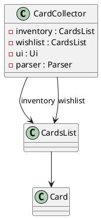
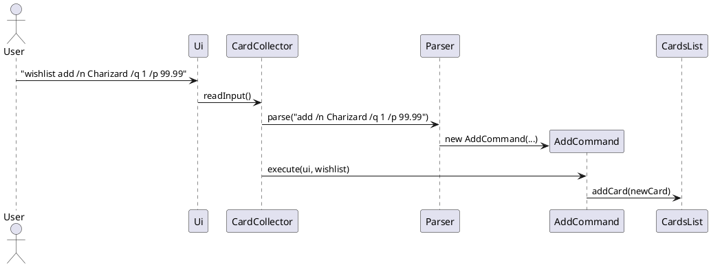

# Developer Guide

## Table of Contents
- [Acknowledgements](#acknowledgements)
- [Design & Implementation](#design--implementation)
    - [Edit Feature](#edit-feature)
      - [Architecture-level](#architecture-level)
      - [Implementation](#implementation-key-code-snippets)
      - [Sequence Diagram](#sequence-diagram-edit-1-n-dragonite-q-3)
    - [Wishlist](#wishlist-feature)
      - [Architecture-level](#architecture-level-1)
      - [Implementation](#implementation-key-code-snippets-1)
      - [Class Diagram](#class-diagram)
    - [Product Scope](#product-scope)
      - [Target User Profile](#target-user-profile)
      - [Value Proposition](#value-proposition) 
    - [User Stories](#user-stories)
    - [Non-Functional Requirements](#non-functional-requirements)
    - [Glossary](#glossary)
      - [Mainsteam OS](#mainstream-os)
    - [Instructions for manual testing](#instructions-for-manual-testing)

## Acknowledgements
- For the PlantUML styling, we adapted from [addressbook-level3](https://github.com/se-edu/addressbook-level3/blob/master/docs/diagrams/style.puml).

{list here sources of all reused/adapted ideas, code, documentation, and third-party libraries -- include links to the original source as well}

## Design & implementation

The architecture of CardCollector consists of three main components:
1. **`Ui`**: Handles all interactions with the user (reading input and printing formatted output).
2. **`CardCollector`**: The main logic controller that parses user input and executes the appropriate commands.
3. **`CardsList` & `Card`**: The data structures storing the inventory and individual card details, including timestamp history.

To model the interactions that occur when the user issues the command `history added all`, below is a *Sequence Diagram* to illustrate it.


**Note:** The lifeline for `HistoryCommand` actually ends at the destroy marker (X), but due to a limitation in PlantUML, the dotted lifeline continues downwards.

### Edit Feature

The `edit` command allows users to change the name, quantity, or price of any card in the list.

#### Architecture-level
When the user types `edit 1 /n Dragonite /q 3`:
1. `Ui` reads the raw input.
2. `CardCollector` passes the input to `Parser`.
3. `Parser` creates an `EditCommand` object.
4. `CardCollector` calls `execute()` on the command, passing the correct `CardsList`.
5. The card is updated and the UI shows the new list.

#### Implementation (key code snippets)

**Parsing logic for `edit`** in `Parser.java` (inside `handleEdit`):

```java
String[] parts = args.trim().split(REGEX_WHITESPACES, 2);
int index = Integer.parseInt(parts[0].trim()) - 1;

String flagArgs = parts.length > 1 ? parts[1] : "";

String name = null;
Integer quantity = null;
Float price = null;

if (flagArgs.contains("/n")) {
    name = flagArgs.split("/n")[1].split("/q|/p")[0].trim();
}
if (flagArgs.contains("/q")) {
    quantity = Integer.parseInt(flagArgs.split("/q")[1].split("/n|/p")[0].trim());
}
if (flagArgs.contains("/p")) {
    price = Float.parseFloat(flagArgs.split("/p")[1].split("/n|/q")[0].trim());
}

if (name == null && quantity == null && price == null) {
    throw new ParseInvalidArgumentException(...);
}
return new EditCommand(index, name, quantity, price);
```

**Core editing logic** in `CardsList.java`:

```java
public void editCard(int index, String newName, Integer newQuantity, Float newPrice) {
    Card card = cards.get(index);
    Instant currentInstant = Instant.now();
    boolean anyChange = false;

    if (newName != null && !newName.trim().isEmpty()) {
        card.setName(newName.trim());
        anyChange = true;
    }
    if (newQuantity != null) {
        card.setQuantity(newQuantity);
        anyChange = true;
    }
    if (newPrice != null) {
        card.setPrice(newPrice);
        anyChange = true;
    }

    if (anyChange) {
        card.setLastModified(currentInstant);
    }
}
```

**Success message** in `Ui.java`:

```java
public void printEdited(CardsList inventory, int index) {
    System.out.println("I have edited card " + (index + 1) + "!");
    printList(inventory);
}
```

#### Sequence Diagram (`edit 1 /n Dragonite /q 3`)
- ADD THE DIAGRAM 

**Design decisions**
- Require **at least one** field to be edited (enforced in Parser).
- Reuse existing flag-parsing style (`/n`, `/q`, `/p`).
- `lastModified` is updated automatically so `history modified` works without extra changes.

**Alternatives considered**
- A single `UpdateFieldCommand` for every field — rejected (too many tiny classes).
- Editing by name instead of index — rejected to keep consistency with `remove INDEX`.

### Wishlist Feature

The wishlist is a completely separate card list that supports **every** existing command (add, edit, list, find, remove, history, etc.). Users must prefix commands with `wishlist `.

#### Architecture-level
`CardCollector` holds **two independent** `CardsList` instances (`inventory` and `wishlist`).  
Prefix detection and routing to the correct list happen **only** in `CardCollector.run()`. All command classes and the `Parser` remain untouched.

#### Implementation (key code snippets)

**Prefix detection and list routing** in `CardCollector.run()`:

```java
boolean isWishlistCommand = false;
String parseInput = input;

if (input.toLowerCase().startsWith("wishlist ")) {
    isWishlistCommand = true;
    parseInput = input.substring(9).trim();
}

...

Command command = parser.parse(parseInput);
CardsList targetList = isWishlistCommand ? wishlist : inventory;
CommandResult result = command.execute(ui, targetList);
```

**Generic `printList` method** in `Ui.java` (used by both lists):

```java
public void printList(CardsList list) {
    if (listSize == 0) {
        System.out.println("Your card list is empty!");
    } else {
        System.out.println("Here is your card list!");
        for (int i = 0; i < listSize; i++) {
            System.out.println((i + 1) + ". " + list.getCard(i));
        }
    }
}
```

#### Class Diagram



#### Sequence Diagram (`wishlist add` example)



**Design decisions**
- Two separate `CardsList` objects inside `CardCollector` because behaviour is identical.
- All routing logic is confined to `CardCollector.run()` so no command classes or Parser needed changes.
- Each list keeps its own history, so `history` and `history modified` work independently.

**Alternatives considered**
- Wrapper commands (e.g. `WishlistAddCommand`) — rejected (massive duplication).
- Single `CardCollectionManager` with a map — rejected (overkill for exactly two lists).

## Product scope
### Target user profile
{Describe the target user profile}
- Trading Card Game (TCG) collectors
- Requires a fast and easy way to update quantity, check prices and move cards from wishlist
- is reasonably comfortable using CLI apps
### Value proposition
{Describe the value proposition: what problem does it solve?}
- Quick commands to track cards that you currently own without having to find physical binders

## User Stories

| Version | As a ...      | I want to ...                                                                | So that I can ...                                                               |
|---------|---------------|------------------------------------------------------------------------------|---------------------------------------------------------------------------------|
| v1.0    | TCG Collector | add/remove cards to my collection with their details (name, quantity, price) | maintain an accurate digital catalog of all my cards                            |
| v1.0    | TCG Collector | search for specific cards by name or set using text-based queries            | quickly locate cards in my collection without browsing through physical binders |
| v1.0    | TCG Collector | organise my cards by different categories (set, rarity, card type)           | browse my collection in a structured way that suits my needs                    |
| v1.0    | User          | edit any stored data                                                         | update/correct mistakes when I first add the card                               |
| v1.0    | TCG Collector | view a chronological list of cards I recently added or removed               | quickly see what’s changed in my collection                                     |
| v2.0    | TCG Collector | store my cards data even when I close the application                        | use the app without having to input my current cards again                      |
| v2.0    | TCG Collector | have a wishlist to track what cards I want to get                            | check them off the wishlist once I have them                                    |


## Non-Functional Requirements
- Should work on any [mainstream OS](#mainstream-os) as long as it has Java 17 or above installed
- Should be able to hold up to 1000 cards without a noticeable sluggishness in performance

## Glossary
### Mainstream OS
- Windows, Linux, Unix

## Instructions for manual testing
{Give instructions on how to do a manual product testing e.g., how to load sample data to be used for testing}

